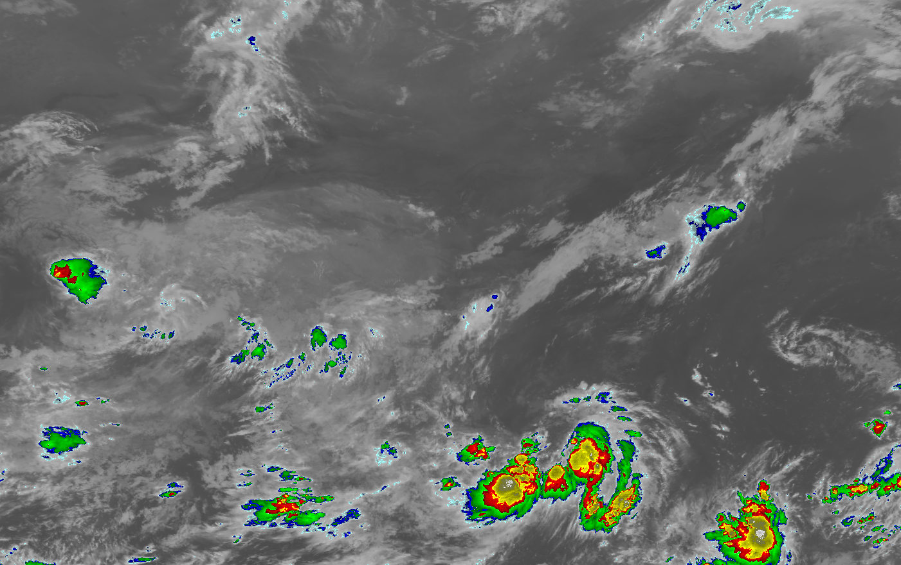

# FY4A 🛰

### 关于

本项目为解析风云四L1类数据和生成色调强化云图图片的 idea java 示例项目。行列号转经纬度的算法来自国家气象卫星中心提供的计算方法，色调增强方案的色阶来自国家气象卫星中心提供的SWAP程序。

### 数据文件
文件存放在 `data` 目录下，为4000M分辨率下的全圆盘数据；输出的色调强化云图图片也存放在 `data` 目录下。由于HDF文件大于100M，因此压缩成7z格式文件，请解压到 `data` 目录下后再运行程序。

### 依赖
本项目依赖 `netCDF` 第三方库，jar 文件存放在 `lib` 目录下。

